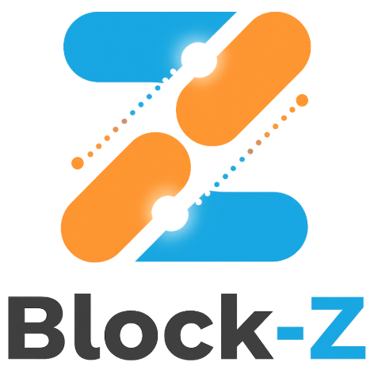

<p align="center">
  
</p>

**Block-Z** is a **No-Code Zephyr Firmware Builder** and visual configuration tool specifically designed for **RAKwireless WisBlock** IoT hardware.

Setting up a Zephyr development environment usually involves complex toolchain installations (`west`, `cmake`, `ninja`, python dependencies, etc.). Block-Z solves this by providing a streamlined, containerized build system combined with an intuitive drag-and-drop interface.

> **Simplify your IoT workflow:** From visual assembly to firmware binary, without writing a single line of boilerplate code or fighting with environment variables.

## See It in Action
[blockz_demo.webm](https://github.com/user-attachments/assets/515e36ff-559d-4536-9697-1aa851013d91)


## Features

### Zero-Setup Zephyr Environment
- **Containerized Toolchain**: Forget about manually installing the Zephyr SDK. Block-Z leverages **Docker** to encapsulate the entire build environment.
- **Instant Compilation**: The backend handles the complex `west build` commands, allowing you to focus on logic rather than configuration.

### No-Code Firmware Builder
- **Visual Configurator**: Interactive drag-and-drop canvas to virtually assemble your WisBlock system.
- **Auto-Generated Firmware**: Based on your visual layout, Block-Z automatically generates the Device Tree (DTS) and project configuration files needed for Zephyr.
- **Smart Compatibility**: The system automatically enforces slot rules (e.g., Slot A/B/C/IO) to ensure modules are physically and electrically compatible with the Base board.
- **LoRaWAN® Region Support**: Easily configure your target LoRaWAN region (e.g., EU868, US915, AS923) directly from the UI. The builder automatically injects the correct frequency plans and regulatory settings into the firmware, eliminating the need to manually edit Kconfig files.

### Comprehensive Module Library
Built-in catalog of popular WisBlock components ready for drag-and-drop:
- **Base Boards**: RAK19007.
- **Cores**: RAK4631 (nRF52840), RAK3172 (STM32WLE5), RAK3112 (ESP32-S3).
- **Sensors**: Environmental (RAK1901), Acceleration (RAK1904), and more.
- **IO Modules**: Relays (RAK13007), interfaces, and connectors.

### Build Console
- **Real-time Feedback**: A terminal-like interface allows you to monitor the firmware generation and build process directly from the web UI.

## Quick Start

### Prerequisites

- Docker
- Docker-compose

1. **Pull Developer Docker Image:**
    ```bash
    docker pull ghcr.io/zephyrproject-rtos/zephyr-build:main
    ```

2. **Clone the repository:**
    ```bash
    git clone https://github.com/kuohsianglu/block-z.git
    cd block-z
    ```

3. **Run with Docker Compose:**
    ```bash
    ./run-docker
    ```

4. **Open the app:**
    Visit [http://localhost:3000](http://localhost:3000).

## Development Getting Started

### Prerequisites

- Node.js 20+
- npm

### Installation

1.  **Clone the repository:**
    ```bash
    git clone https://github.com/kuohsianglu/block-z.git
    cd block-z
    ```

2.  **Install dependencies:**
    ```bash
    npm install
    ```

3.  **Run the development server:**
    ```bash
    npm run dev
    ```

4.  **Open the app:**
    Visit [http://localhost:3000](http://localhost:3000) to start building your WisBlock system.
